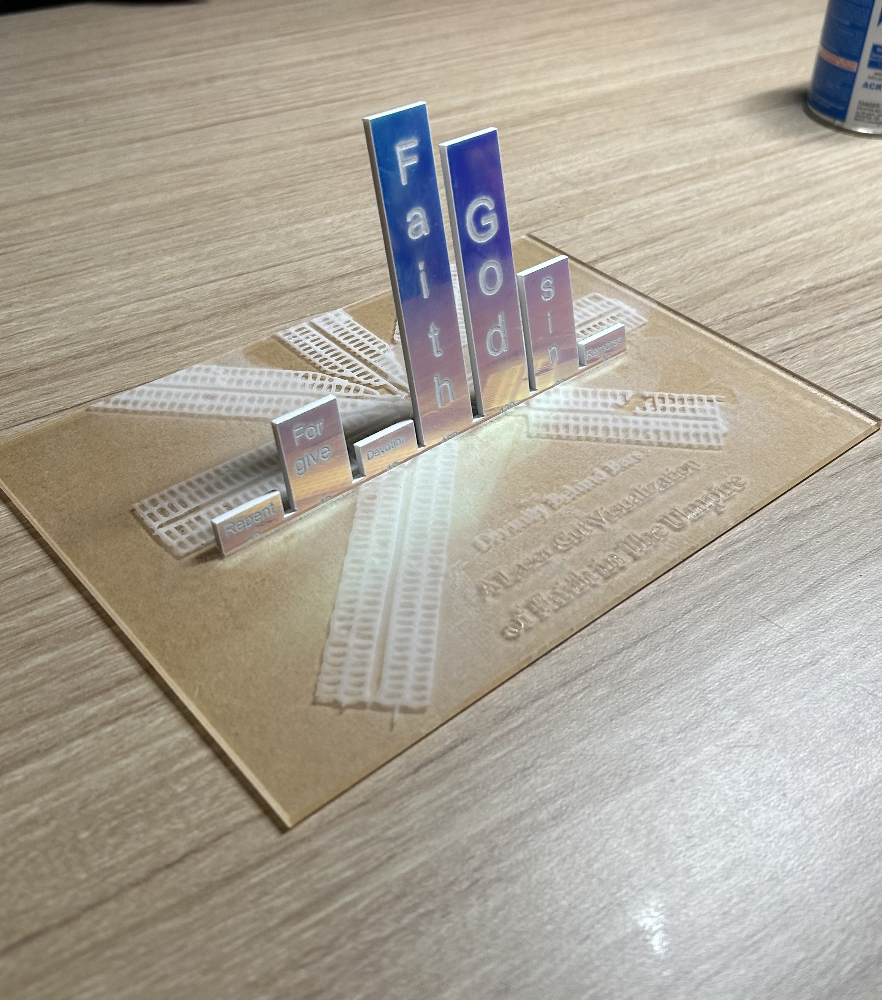
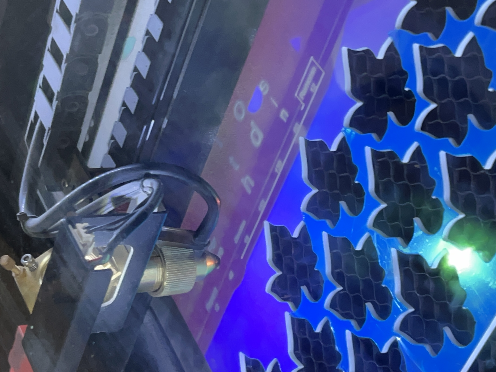

<h2>Reflection on Group Project in Education Commons </h2>

As part of fabrication group 1, my group visualized the prevalence of faith-based terms in the Umpire using the laser cutter. Approaching this assignment as a chance to explore important themes throughout the Umpire, we came up with the idea of word prevalence. Word prevalence not only exposed us to salient themes, but reflected which words prisoners may have encountered most frequently, potentially shaping their experiences while consuming the text of the Umpire. We searched through the different topic tags in the excel document, finding a few themes such as religion, baseball, and jokes to be mentioned throughout the Umpire. Because we established early on in our process that our overall goal was to create a project about data that we found meaningful, we narrowed the topic down to faith/religion as a group. We considered including multiple themes but found that focusing on one topic would allow us to create a design that captured the importance of this topic. We wanted our design to be intentional, especially since we were able to utilize the materials in Education Commons and chose a narrower topic. This turned out to be beneficial because we could reflect this topic fully with our materials/design as opposed to using materials that may have not held significance for all of the themes.

Our team held two meetings to discuss our project. One was in person and our main brainstorming one was virtual over zoom. In both meetings, we worked well together and didn’t run into major collaborative issues. I worked as the design facilitator, meaning that it was my responsibility to ensure that everyone was on the same page with our design, and working with the documentarian to document the design process with sketches and notes. I happened to be the person with Adobe Illustrator, so I also created the design file and design. Furthermore, I jointly took charge of the documentarian role during our design day in the Education Commons with the project manager because our documentarian was not able to be there that day. Overall, our roles were distinct leading up to the time in the Education Commons. I planned to devise strategies so that everyone would have the chance to voice their ideas in the meeting, but everyone seemed to voice theirs very well, so I did not have to work very hard to ensure that the meeting was a collaborative process. However, I made sure that the model which I designed fit everyone’s preference and frequently asked for their opinion in the groupchat. Our roles became a little bit more blurred once we started working on our project since I had the Adobe file on my cloud and worked a lot on the fabrication aspect because of this, and most of the group just was really interested in working together as a whole without too many role restrictions. 

As for the design aspect itself, after pinpointing religion/faith as our topic, we decided to explore the dataset. As a group, we all went into the excel sheet and used control f (with spaces before and after the word to make sure our results were not part of a bigger word) to find the prevalence of many words that we thought were faith-based. We ended up picking God, faith, sin, devotion, forgive, remorse, and repent as our words to visualize. In retrospect, some of these words could’ve signified something other than religion. For example, remorse or faith can be used in other situations, not just text regarding faith. Yes, these words did have faith-based connotations, but overall, they were not faith-exclusive. The group concluded that we would still like to use these words because of their faith-based connotation which could remind prisoners of faith regardless of where they were situated. In my personal opinion, I wished that we spent more time finding faith exclusive words, but I understand the validity of the counter-argument. In the end, we did not describe our project as finding words that were about faith themselves, but faith-based words, which I believe depicted the project accurately. After finding the words and coding for their frequency, our group discussed the ways to visualize our project. We ultimately decided on a 3D graph or a 2D word cloud as our final choices. I decided to try to combine both of these ideas in the design which I proposed. The idea of a 3D piece rather than a 2D one seemed like it would make better use of the materials in Education Commons–especially since we could have just drawn a 2D project on a piece of paper. However, I wanted to honor the wishes of the people who proposed the word cloud, so I used larger text on the more prevalent words similar to the word cloud element. When it was time to pick out our materials in the Education Commons, a lot of discussion happened regarding the significance of the materials. Rather than choosing something that was only aesthetically pleasing, we wanted to send a message with what we were creating. We chose an iridescent piece of acrylic which was both reflective and color-changing. The color-changing nature was chosen because it reflected the dynamic nature of faith, while the reflective element would allow the viewer to see their face behind the faith-based words. Furthermore, we decided to engrave the picture of Eastern State Penitentiary on the bottom, signifying that it was the base to the Umpire. We also placed the picture of Eastern State so that the majority of it was reflected on the back of the graphs, which related to the fact that Eastern State Penitentiary was likely in the subconscious of most prisoners engaging in faith-based activity. 

Overall, I believe that our design turned out very well. Unfortunately, a lot of the members were not present when we made the final project and weren’t there to pick out the materials. All of them seemed satisfied with the materials that we chose. However, when we were at the Education Commons, my group members and I found it very easy to be creative and I wonder how our project could have evolved if all of our members had been present. 

