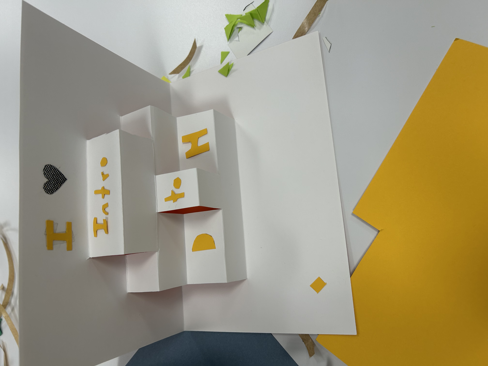

# HelenaGiner.github.io
<h2>About me</h2>

My name is Helena Giner and I am an junior politcal science major at UPenn. Please navigate my website to learn more about my experience in ENGL 1650: Introduction to Digital Humanities!

## Navitate my work
- [Reflection Statement](Reflection.md)
- [Education Commons Reflection](EducationCommonsReflection.md)
- [Printing in Prisons Project](https://printinginprisons.org/blog/ginerhelena/)
- [Looking Forward Statement](Lookingforward2.md)

