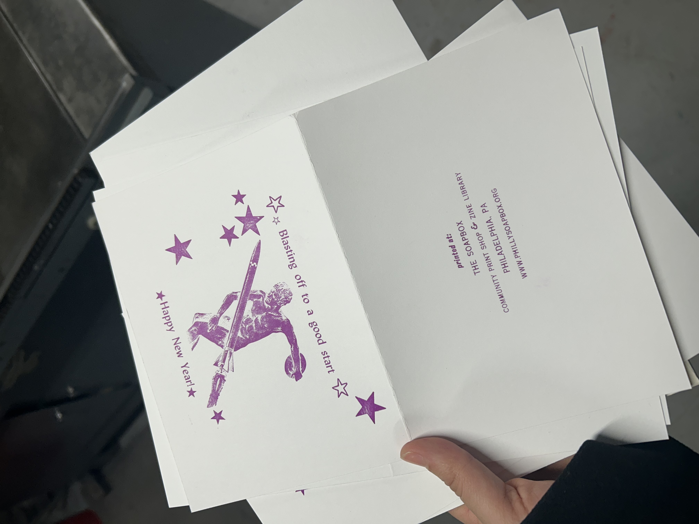
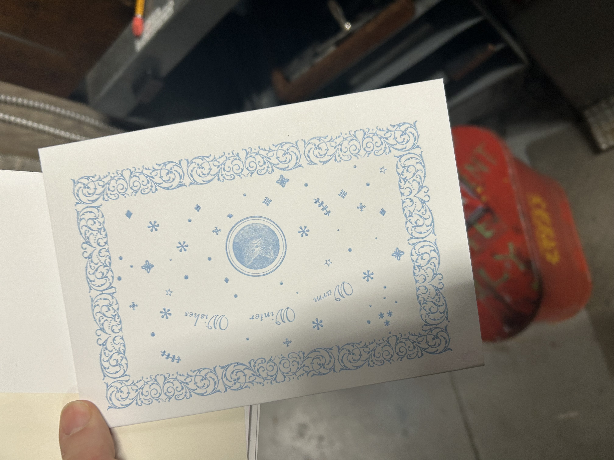
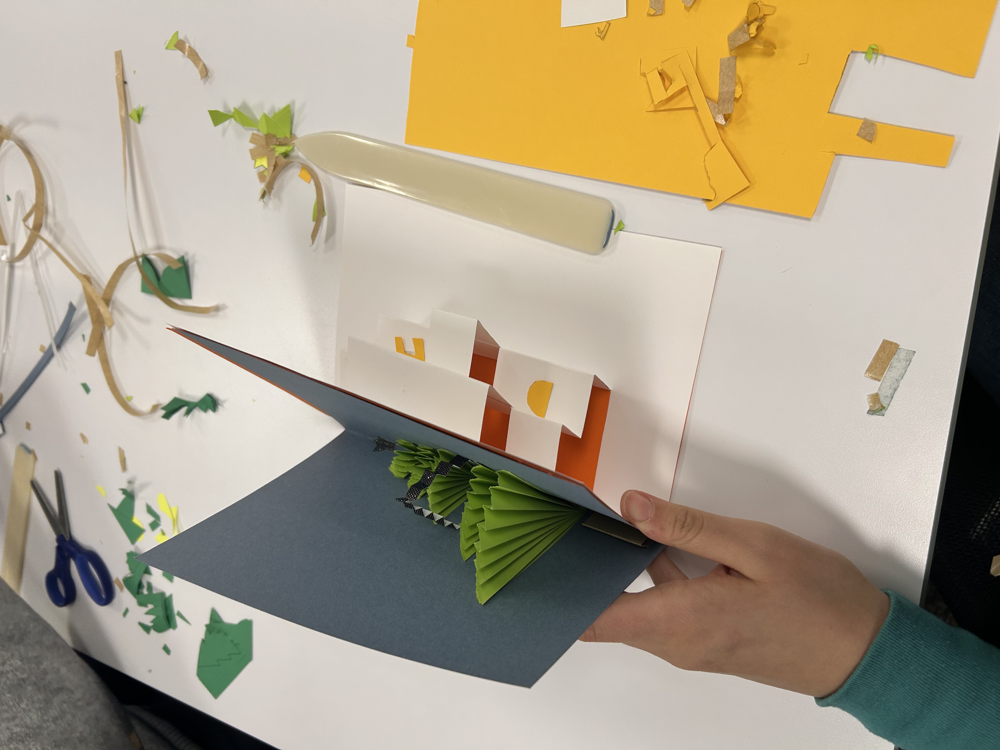
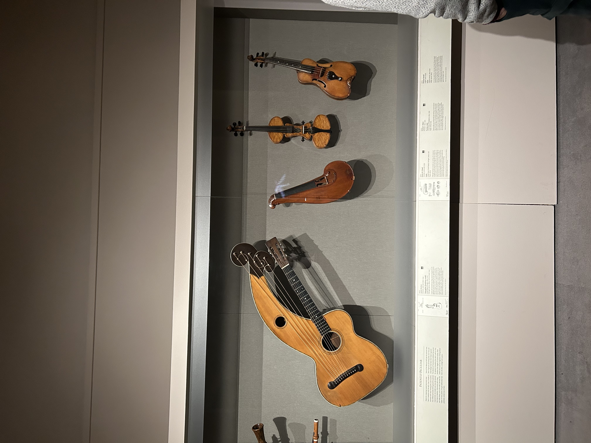
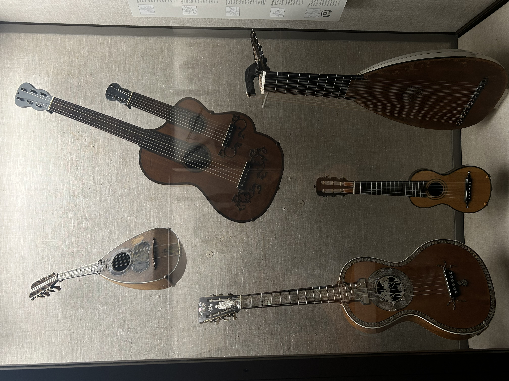

<h2>Philadelphia Workshop Review</h2>

On Saturday December 7th, I attended a Holiday Card workshop at the Soapbox Community Printshop and Zine Library. The workshop had participants use two machines to print an already designed card design with already chosen colors onto six cards. Two topics that I thought of when partaking in the workshop were individuality and the evolution of design. Unlike the last card workshop I attended at Penn, there really was no room for my individual expression in card design unless I would have made a mistake using the printing machine and the ink would have turned out blotchy/not shown up in some areas. However, the same could have been said for the process of transcribing/generating metadata that we did in class on the Reformatory Record. In this case, everything should have been the same as what was printed with slight leeway regarding tags (but overall standardization preferred). The Reformatory Record was printed and so were the cards, which helped me conceptualize the extent of how impersonalized printing could be in its replication process. Although I, as a person, was part of the process, very little evidence of my was reflected in the product unless I directly influenced the design. This was further reinforced by the assistant who helped me with turning the printing press, as they talked to me about mass-production.

Using the printing machine itself and thinking about mass production was something which made me recall the evolution of developments which we discussed in class. For example, before the printing press, cards were handmade, giving more room for personalization. Now, we have digitized forms of writing and creation which are even more standard—Google documents and websites can all look roughly the same compared to physically printed works which might endure weathering, or have variation between paper type, ink type, etc..That is not to say that room for individuality do not exist, there are many digital artists and my mother has an art degree in printmaking herself. When walking home, I actually called my mother to talk to her about using a print machine and she told me that  printmaking as an artform is not regarded as prestigious compared to other artforms due to the potential for replicability. Although I do not know much about art and cannot say if this is true, it made me wonder about the emphasis that we place on “uniqueness” in art and how original works are prized more and how this ties into digital humanities. When approaching digital humanities, there is a similarity between the importance of preserving an individual/entity’s original message, which places the emphasis on the individual and their “unique” ideas rather than the individual drawing from their work. Of course, this is common practice due to manipulation and plagiarism, but the parallels between this and art are interesting to me.

Furthermore, the differences between the machines themselves (one had a lever to turn and one had a wheel) reminded me of the discussion of how objects are created. Chairs are standard with four legs, but probably could be made with three. The shape of our computer screen mirrors printing, the keyboard reflects previous inventions as well. Similarly, there are inventions which could have significantly changed our system of doing things, such as the letter-to-note system of audio reading for the blind, but were not popularized. Musical instruments have gone in and out of fashion as well (I visited the Boston Museum of Fine Arts over break and saw a bunch of unconventional instruments such as a guitar-harp which reminded me of this class). The differences between machines, although not producing a different overall product, were likely produced by people who liked using levers or wheels, respectively. It is interesting to me that both of these designs co-exist, but not very surprising variations exist in a lot of things such as chairs, computers, etc.. I would be more interested in learning about the different printing machines out there and the different reasons behind their design.

<h2>Penn Workshop Review</h2>

Last Tuesday, I attended a “Make a pop-up card” workshop at the Kislak Center to make holiday-themed pop-up cards. The workshop had us make two pop-up cards, one Christmas tree pop-up card and one card with a step-like base which we were encouraged to decorate with Christmas themed cut-outs. We were first instructed to make a Christmas tree card through a series of cuts and folds which were shown to us through a birds-eye projection of the instructor on a smartboard. The colors of paper we used were all standard across participants–blue and green because there were not enough pieces of red paper to make red and green. Although not too significant to me and potentially other people in the room, the change of colors from red and green to blue and green reminded me of themes of preservation, the history of data, and authorship influencing the digital aspect of data expression mentioned in class and in readings. Christmas colors are popularly considered to be red and green, which made me wonder if making the card blue and green would detract from the Christmas meaning of the card, making the card less Christmas-like and more like a regular tree. However, another question which I thought of is why Christmas colors are red and green in the first place. When looking this question up on Google, I found many different explanations ranging from the traditional usage of holly as decoration to commercial Christmas card purposes to red representing Christ’s blood and green representing eternal life. This reminded me of the evolution and synthesis of data depicted in Bouk (2022) and Gil (2018). Similarly to the census data mentioned in Bouk (2022) there are a vast number of sources and written works about the reason for Christmas colors, and similarly to Gil (2018)’s discussion of the digitalized authorship process, there is a tendency of different website authors to pick and choose different theories which they found convincing–backed up by evidence–to create a claim of existence. In reality, many theories probably co-exist, connect to each other, or have evolved from each other in some ways, however, this was not depicted in some articles. This also could be connected to the workshop itself–depending on what authors, or supervisors, deem important/want to preserve in their product, the result may be affected and fundamentally different from what someone would expect or even other Christmas card workshops out there. In any case, I was not bothered by the shift from red to blue, but maybe someone would find it notable. 

 In terms of customization, we were not afforded too much variety of materials or design on the Christmas tree card. However, we were able to customize our second card to a greater degree. I decided to make it not related to Christmas and write “I love (represented by a heart) Intro to D H” on it because I wanted to at the moment. Intro to Digital Humanities (represented by D H) was why I was at the workshop, which influenced my thinking in this design. On the topic of design, our second card derived from a white sheet of paper with standardized printed lines for where we were supposed to cut and where we were supposed to fold. This made me think of the digitalization of pop-up cards as a whole. During previous time in Kislack, we explored different books/paper-based documents, including those with a pop-up or interactive element. We also read Material/digital by Lesser & Trettien, which discussed the barriers to authentic digitalization of material works. How someone would digitize a three dimensional object is relatively uncertain to me. I could see different ways in which one could do this–multiple pictures from multiple angles could be taken to capture the visual aspect, the card could be disassembled and photocopied to make replication easier, however none of this would really recreate the feel of the paper and the experience of opening up a pop-up card. Until new technology is created to resolve this issue, I would say that the pop-up cards created could not be fully represented by digitalization. 

Overall, I enjoyed attending the workshop, especially since I had to think about a digital humanities aspect which made me more attentive to the various aspects of the process which I may have missed otherwise. I probably would not have thought of  blue versus green paper or how to digitize my popup card, and I am grateful that I did because it made the experience more memorable. 

